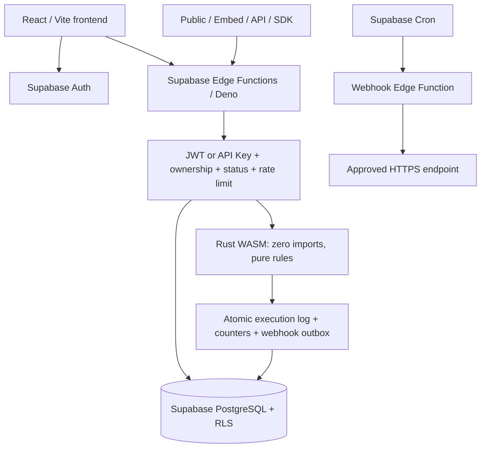

# WasmBot Studio

แพลตฟอร์มสร้าง Business Logic Bot ด้วย React + Supabase Auth/PostgreSQL/Edge Functions และ **Rust WebAssembly จริง** ไม่มี Node backend server, Railway, Render หรือ VPS เป็นส่วนประกอบของระบบ

> สถานะ: เขียนระบบและสร้าง production artifacts แล้ว ตรวจสอบในเครื่องได้โดยไม่ต้องใช้ข้อมูลจำลองในแอป แต่ยัง **ไม่ได้ deploy หรือทดสอบ end-to-end กับ Supabase hosted project** เพราะยังไม่มีโปรเจกต์/credentials ตามที่ผู้ใช้แจ้ง ดูผลที่รันจริงใน [VERIFICATION.md](VERIFICATION.md)

## Features

- Supabase register/login/logout, persistent session, refresh token, forgot/reset password, profile และ protected/admin routes
- Dashboard, bot CRUD, soft deletion, pause/unpublish, visual input/rule builder, AND/OR และ 12 operators, Monaco JSON editor + Zod
- Test playground เรียก Edge Function → Rust WASM → บันทึก execution จริง
- Publish แบบ transaction, immutable rule/input/output snapshots, version history; draft ไม่เปลี่ยน production
- Public pages, schema-generated forms, REST API, iframe/script embed, light/dark/system widget, domain allowlist
- API keys สุ่ม 256 bits, HMAC-SHA256 hash, scopes, bot restrictions, show-once, rename/revoke/soft delete, usage/last used
- TypeScript SDK พร้อม typed result/errors, request timeout และ AbortSignal
- Execution history/detail/filter/pagination, PostgreSQL analytics, 7/30-day charts
- Encrypted webhook configuration, HMAC signature, transactional outbox, lease-based concurrent delivery, สูงสุด 3 attempts
- Admin dashboard/users/bots/executions/reports/settings/audit logs/monitoring พร้อมตรวจ role ใน Edge Functions และ privileged DB functions
- Shared PostgreSQL rate limits, RLS, field-level profile grants, bounded JSON payloads, no fake database/auth/WASM

## Architecture



Frontend ใช้ anon key เท่านั้น; Edge Functions ใช้ service role หลังตรวจ JWT ผ่าน `auth.getUser()` หรือตรวจ hashed API key. Admin role/status อ่านจาก DB ทุกคำขอ ไม่มีการเชื่อ client role/JWT metadata เพื่ออนุมัติ admin actions

### Project map

```text
frontend/src/                    React pages, shared controls, auth and API client
supabase/functions/_shared/     Schema, policy, crypto, WASM, execution, webhooks
supabase/functions/studio/      Bot lifecycle, analytics, executions
supabase/functions/run-bot/     Authenticated draft execution
supabase/functions/public-bot/  Public metadata/run, embed, report
supabase/functions/api-run/     Scoped API-key execution/read access
supabase/functions/api-keys/    Owner API key management
supabase/functions/admin/       Admin APIs
supabase/functions/webhooks/    Webhook settings and outbox dispatcher
supabase/functions/wasm-runtime/ Rust source, Cargo.lock, raw WASM ABI
supabase/migrations/            Tables, RLS, transactions and grants
supabase/schedules.sql          Optional Supabase Cron/Vault setup for retry workers
sdk/                           @wasmbot/sdk source, types and usage guide
scripts/                       WASM build/security checks, SQL verification
 tests/                        Unit, component and opt-in real Supabase integration
```

## Database tables

| Table | Purpose |
|---|---|
| `profiles` | Auth-linked identity, username/email, role/status, last active |
| `bots` | Owner, editable draft, public slug, access channels, limits, widget, counters, lifecycle |
| `bot_deployments` | Immutable rule/input/output snapshots, monotonically increasing version, active version |
| `executions` | Request ID, source, input/output, deployment/key IDs, status, duration, memory/error |
| `api_keys` | Hash/prefix, scopes, selected bot IDs, revocation, use counters |
| `bot_webhooks` | Destination, AES-GCM encrypted signing secret, enabled flag |
| `webhook_deliveries` | Durable outbox, lease, attempts, status, next retry |
| `bot_reports` | Public reports and admin review states |
| `admin_logs` | Append-only administrative audit records |
| `system_settings` | Platform limits and feature switches |
| `rate_limit_buckets` | Atomic shared rate-limit counters; hashed public identities |

Indexes cover owner, slug, status, time, execution history, deployment uniqueness, report queues and webhook dispatch. Soft-delete retains executions and audit logs; it does not cascade-delete history. Admin user Delete deactivates the application account, revokes keys and soft-deletes bots while retaining the Supabase Auth identity and records for audit.

## 1. Install development tools

- Node.js **24 LTS** and pnpm **11.19.0** (version pinned in package.json)
- Current stable Rust + `wasm32-unknown-unknown` target; wasm-pack is **not** required
- Supabase CLI (current version with `static_files`, at least 2.7)
- Docker Desktop/Engine for Supabase local stack and CLI WASM static-file deployment
- Deno is included as a development dependency for checks

```sh
corepack enable
corepack prepare pnpm@11.19.0 --activate
pnpm install --frozen-lockfile
rustup target add wasm32-unknown-unknown
pnpm build:wasm
```

Install Rust from [rustup.rs](https://rustup.rs/) and the CLI from the [Supabase CLI instructions](https://supabase.com/docs/guides/local-development/cli/getting-started). The build script runs only our checked-in Rust project, never user-provided code.

## 2. Create and configure Supabase

1. Create a **new dedicated Supabase project**. Save its project reference, Project URL, public anon key, and service-role key securely.
2. In Authentication → URL Configuration, set Site URL to your frontend origin. Add `http://localhost:5173/reset-password` for local development and your production `/reset-password` URL. Add dashboard confirmation redirects when using a different origin.
3. Enable Email authentication and email confirmation. Configure production SMTP and Auth rate limits/CAPTCHA as appropriate for your application.
4. Link the project and apply the migration:

```sh
supabase login
supabase link --project-ref YOUR_PROJECT_REF
supabase db push
```

Alternatively, execute `supabase/migrations/202609210001_initial.sql` once in the Supabase SQL Editor on a fresh project. The migration deliberately restricts `public` schema grants, so do not apply it blindly to a shared existing application's database.

`profiles` is created by a trigger on `auth.users`; client metadata cannot choose role/status. Registration defaults to on. Switching `allow_registration` off in Admin Settings causes the profile trigger to reject new registrations; the Supabase Auth provider settings should also be aligned for clearer user-facing messaging.

## 3. Environment variables

```sh
cp .env.example .env
cp .env.edge.example .env.edge
```

Frontend `.env` at repository root:

```dotenv
VITE_SUPABASE_URL=https://YOUR_PROJECT.supabase.co
VITE_SUPABASE_ANON_KEY=YOUR_PUBLIC_ANON_KEY
VITE_APP_URL=http://localhost:5173
```

Edge secrets:

| Variable | Meaning |
|---|---|
| `SUPABASE_URL` | Supabase injects the project's URL |
| `SUPABASE_ANON_KEY` | Supabase injects this; frontend uses its own public copy |
| `SUPABASE_SERVICE_ROLE_KEY` | Supabase injects this into Edge runtime only |
| `API_KEY_HASH_SECRET` | Random server-only key for API key HMAC and rotating IP hashes; at least 32 chars |
| `WEBHOOK_ENCRYPTION_KEY` | Exactly 32 random bytes encoded as base64, used with AES-256-GCM |
| `WEBHOOK_SIGNING_SECRET` | Random scheduler authentication token; at least 32 chars |
| `WEBHOOK_ALLOWED_HOSTS` | Comma-separated exact HTTPS hosts approved by the operator; empty denies destinations |
| `APP_URL` | Frontend deployment URL, reserved for deployment configuration |

Generate **separate** random values with `openssl rand -hex 32` for HMAC/scheduler secrets and `openssl rand -base64 32` for the encryption key. Never put service-role keys or these secrets into a `VITE_` variable. `.env*` secret files are ignored by Git.

```sh
supabase secrets set --env-file .env.edge
```

Do not set the reserved Supabase-injected variables through `secrets set`; `.env.edge.example` deliberately omits them. Changing `API_KEY_HASH_SECRET` invalidates existing API keys. Changing the encryption key requires re-encrypting existing webhook secrets; do not rotate it without a migration plan.

## 4. Deploy Edge Functions

Build the WASM artifact **before** deploying functions. The binary is generated rather than checked into Git.

```sh
pnpm build:wasm
supabase functions deploy studio
supabase functions deploy run-bot
supabase functions deploy public-bot
supabase functions deploy api-run
supabase functions deploy api-keys
supabase functions deploy admin
supabase functions deploy webhooks
```

`supabase/config.toml` declares import maps and bundled WASM static files. Use the CLI with Docker for these WASM deployments; the API-only deploy path does not support the static WASM file in the documented workflow. See [Supabase WASM bundling](https://supabase.com/docs/guides/functions/wasm) and [dependency configuration](https://supabase.com/docs/guides/functions/dependencies).

`verify_jwt=false` is intentional: public endpoints and `wbot_live_` tokens must reach the handler. **This does not remove authorization**: every private function verifies Supabase JWT explicitly; admin role and account status are then checked in PostgreSQL. API keys use a separate verification path.

## 5. Run locally

### Frontend against your hosted Supabase project

```sh
pnpm dev
# Open http://localhost:5173
```

With missing frontend credentials, the app shows an honest setup screen; it does not create a fake workspace, fake login, or sample database records.

### Fully local Supabase stack (requires Docker)

```sh
supabase start
supabase db reset
pnpm build:wasm
supabase functions serve --env-file .env.edge
pnpm dev
```

Use URL/anon key from `supabase status` in `.env`. The local email inbox is available through the URL printed by the CLI; follow its confirmation/reset links. `db reset` destroys the local database—use it only for the local development stack.

## 6. Production frontend

```sh
pnpm build
# Static frontend output: dist/
# SDK output: sdk/dist/
```

Deploy the frontend to Vercel or Netlify using the included `vercel.json` or `netlify.toml`. Set the three `VITE_` values before building and set `VITE_APP_URL` to the final origin. SPA rewrites cover `/bots/*`, `/b/*`, `/embed/*`, and auth routes. Backend stays entirely on Supabase.

Apply an appropriate CSP at the frontend host. Do not globally send `X-Frame-Options: DENY` or `frame-ancestors 'none'` to `/embed/*`, because that would break embedding. If stronger embed restrictions are needed, dynamically emit a bot-specific `frame-ancestors` policy from a controlled hosting layer.

## 7. Create the first administrator

Register and confirm a real account. Then run in Supabase SQL Editor as a privileged project operator:

```sql
update public.profiles
set role = 'ADMIN'
where id = 'UUID_OF_YOUR_CONFIRMED_AUTH_USER';
```

Use the exact Auth user UUID, then sign in/reload the app. No default admin credentials exist. Ordinary clients cannot update `role`, `status`, or invoke service-only mutation functions. The admin UI cannot remove its own administrative access accidentally.

## 8. Create, test, and publish a bot

1. Register/login → **Create bot**.
2. A grade-rule starter is editable form content, not a stored bot. Rename it or choose your own fields.
3. Add `score` of type number, required, min 0, max 100.
4. Set rules in descending order: `>=80 → A`, `>=70 → B`, `>=60 → C`, `>=50 → D`, else `F`. Each rule supports multiple conditions with AND/OR.
5. Save. Bot is now stored in Supabase as a draft.
6. Open **Test**. Enter `85`; **Run test** calls the Edge Function and Rust WASM. It returns `A`, request ID, execution duration and linear-memory size. Test executions are logged; draft tests do not send external webhooks.
7. Click **Publish bot**. A transaction creates V1 and marks it active. Open **Deploy**, enable the desired access channels, and save.
8. Open the Public URL and run `72 → B`.
9. Editing/saving rules later changes only the draft. **Publish new version** atomically creates V2 and switches the active snapshot. A request already admitted against V1 may finish with V1; its log records that version.

Output formats: Text, Number, Boolean, JSON, Message, Table. Table expects an array of row objects. Rule outputs are literal JSON values; this engine intentionally does not execute arbitrary programs or arithmetic expressions.

## 9. API keys and REST API

Go to **Developer → API keys → Create API key**. Choose name, scopes and optional selected bots. The key is shown only once; copy it to your server's secret store.

```sh
curl -X POST 'https://YOUR_PROJECT.supabase.co/functions/v1/api-run' \
  -H 'Authorization: Bearer wbot_live_YOUR_KEY' \
  -H 'Content-Type: application/json' \
  -d '{"bot":"YOUR_PUBLIC_SLUG","input":{"score":95}}'
```

```json
{"success":true,"data":"A","execution":{"executionTimeMs":4,"requestId":"uuid","memoryUsed":327680,"version":1}}
```

The above response illustrates the schema; real duration/memory/ID come from runtime. A bot can be selected by ID or public slug. The bot must be active, published and have API access enabled; owner must be active, key must be valid, unrevoked and correctly scoped.

Scopes: `bot:run` (default), `bot:read`, `execution:read`. POST the same endpoint with `action:"read"` for production schema or `action:"executions"` for the most recent 50 executions; each requires its respective scope.

Default limits are 30 API executions/minute/key and 20 public executions/minute/hashed IP, further bounded by each bot's configured limit. Rate-limit buckets are in PostgreSQL, shared across workers. HTTP 429 includes `Retry-After: 60`. Supabase Auth separately rate-limits login/signup; this app does not implement a replacement password backend.

Errors use `{success:false,error:{code,message},requestId}`. Documented codes include `UNAUTHORIZED`, `FORBIDDEN`, `BOT_NOT_FOUND`, `BOT_DISABLED`, `BOT_BLOCKED`, `BOT_NOT_PUBLISHED`, `API_DISABLED`, `INVALID_API_KEY`, `API_KEY_REVOKED`, `RATE_LIMITED`, `VALIDATION_ERROR`, `WASM_ERROR`, `OUTPUT_TOO_LARGE`.

## 10. Embed and public pages

```html
<iframe
  src="https://YOUR_APP/embed/YOUR_SLUG?theme=dark&compact=true"
  width="400" height="500" title="Grade calculator"
  style="border:0;border-radius:16px">
</iframe>
```

Or use the script for automatic resizing and parent-origin handshake:

```html
<script src="https://YOUR_APP/widget.js" data-bot="YOUR_SLUG" data-theme="light"></script>
```

Set title, placeholder, button text, theme, bot-name visibility and branding in Bot Settings. Public Page at `/b/:slug` and Embed at `/embed/:slug` use the **published** input/output schema, never the draft.

Allowed Domains are exact host names including port, e.g. `shop.example.com`, `localhost:5173`. Empty means allow all. Embed checks the parent browser origin via referrer or a `postMessage` whose source is the parent, then sends it to the Edge Function. This is browser embedding policy, **not an authentication boundary against a non-browser caller that can forge headers**. Use API keys for authenticated integrations. Sites that hide referrer should use `widget.js` for handshake.

## 11. SDK

```sh
pnpm build:sdk
# From another application:
pnpm add /absolute/path/to/WasmBot-Studio/sdk
```

```ts
import { WasmBot, WasmBotError } from '@wasmbot/sdk';
const bot = new WasmBot({
  supabaseUrl: 'https://YOUR_PROJECT.supabase.co',
  bot: 'YOUR_SLUG',
  apiKey: process.env.WASMBOT_API_KEY!,
});
const result = await bot.run<string>({ score: 85 });
console.log(result.data);
```

An explicit project URL is required because each installation has its own Supabase backend. The SDK is buildable locally; it has not been published to the npm registry. See [sdk/README.md](sdk/README.md).

## 12. Webhooks

In Bot Settings, enter an operator-approved HTTPS URL, a signing secret of at least 16 characters, enable and save. The secret is encrypted with AES-GCM and is never returned by read APIs. The bot itself has no network access; only the Edge outbox worker sends HTTP after successful production execution is committed.

Header: `X-WasmBot-Signature: t=UNIX_SECONDS,v1=HMAC_HEX`.

Verify HMAC-SHA256 over `timestamp + "." + exactRawBody` using the configured per-webhook secret. Reject stale timestamps (e.g. >5 minutes) and deduplicate by `X-WasmBot-Delivery` or payload `requestId`. Retries are at-least-once, so receivers must be idempotent.

- HTTP redirects are rejected, timeout 5 seconds; any non-2xx retries.
- Only exact hosts in the server secret `WEBHOOK_ALLOWED_HOSTS` are accepted; numeric IPs, HTTP, userinfo, and non-443 ports are denied.
- The host allowlist is an operator trust boundary. Approve only DNS names you control/trust; DNS rebinding is not eliminated by this application.
- Execution and outbox creation are one PostgreSQL transaction.
- A background `waitUntil` triggers the first attempt. To guarantee retries when there are no further runs, configure Supabase Cron.

In Dashboard → Vault, save `wasmbot_project_url` and `wasmbot_dispatch_secret` (same value as `WEBHOOK_SIGNING_SECRET`). Run `supabase/schedules.sql`. This dispatches due webhook deliveries every minute and cleans stale leases/old rate buckets every five minutes. An outbox claim handles up to 10 deliveries; for high volume tune scheduling/batching within Edge limits. The UI can also process due retries manually.

## 13. RLS and security model

- RLS enabled on all 11 application tables.
- Authenticated users read their own profile, active-account owned bots, deployments and executions.
- Only `username` and `avatar_url` have direct authenticated UPDATE grants; role/status/email cannot be client-escalated.
- Bot writes are intentionally routed through authenticated Edge Functions for Zod validation, quotas and lifecycle enforcement. There are no direct browser INSERT/UPDATE/DELETE grants on bots.
- API-key hashes, webhook secrets, settings, rate buckets and audit tables have no browser table access.
- Public metadata goes through `public-bot` with published/active/channel/owner checks. It returns safe schema/appearance fields, not rules, owner email or credentials.
- Privileged RPCs that accept user IDs are executable only by service role. Functions set a fixed empty search path and qualify tables.
- Admin mutations verify active DB admin role and write audit logs in the same transaction.
- Publish/unpublish/status/delete use row locks/transactions; counters and outbox are atomic; active deployment has a unique partial index.
- Service-role secrets remain in Edge Functions. The frontend imports only schema/policy code, never server utilities.
- API keys use CSPRNG and HMAC-SHA256, no plaintext key storage. Public IPs are HMACed with a daily salt; raw IPs are not stored by the application. Hosted Supabase logs are governed separately by Supabase.
- IP limiting trusts the forwarding header supplied by the deployment gateway. Verify/normalize this header if adding another proxy; it is not a defense against arbitrary proxy misconfiguration.
- Request bodies are streamed with a 64 KiB maximum, limited to 32 levels and 10,000 JSON nodes. WASM requests (rule+input+schema) have a 128 KiB maximum and output a 64 KiB maximum.

### Why Rust WASM

The shipped interpreter is Rust compiled to `wasm32-unknown-unknown`. Its exported ABI is `memory`, `alloc(len)`, and `evaluate(ptr,len)` (packed 64-bit output pointer/length). Deno instantiates a **fresh module instance per execution** with an empty import object and rejects modules that declare any imports. No WASI, filesystem, sockets, environment, shell, database, clock or host callbacks are exposed to the engine. Only this checked-in binary is executed—users upload declarative rules, not WASM modules or programs.

A linker-enforced memory maximum of 32 MiB is verified against the built binary. Rules are bounded to 100 rules × 20 conditions and have no user-defined loops/recursion. This bounded interpreter avoids relying on a JavaScript timer to interrupt synchronous WASM. Supabase additionally enforces platform worker CPU/memory limits; it does not provide per-invocation Wasmtime fuel control here. See [Supabase limits](https://supabase.com/docs/guides/functions/limits). A hard platform termination cannot reliably persist a final TIMEOUT execution; monitor Supabase function logs for those failures.

## 14. Tests and verification

```sh
pnpm typecheck
pnpm lint
pnpm test                 # Vitest + React Testing Library
pnpm test:sql             # Apply real SQL to embedded PostgreSQL, exercise RLS/RPCs
pnpm build:wasm
pnpm test:wasm            # Execute real Rust binary, operators, cap, no imports
pnpm test:edge            # Deno WASM execution + crypto + payload policies
pnpm check:edge           # Typecheck all seven functions with deployment import map
pnpm build               # Production frontend + TypeScript SDK
pnpm verify              # All the above (Rust needs to be installed)
cargo test --locked --manifest-path supabase/functions/wasm-runtime/Cargo.toml
```

`test:sql` uses PGlite (actual PostgreSQL compiled to WASM) and applies the real migration. Its harness supplies only the platform-owned Auth table/roles/`auth.uid()` so RLS can be tested. It does **not** claim to test Supabase Auth. No in-memory substitute is used in the application. Also run `supabase db lint --local --level warning` with the Docker Supabase stack when available.

### Real Supabase acceptance scenario

`tests/integration.test.ts` registers actual accounts, uses actual login, creates bot rows, executes real deployed WASM, publishes versions, calls public/API/embed, tests revocation/ownership/RLS/admin and checks logs/analytics. It never intercepts backend responses.

Use only a **dedicated test project** with deployed functions, email signups enabled and test SMTP configured. The test creates three real users and retains soft-deleted bot/execution/audit data. It uses service role only for automated email confirmation/admin setup and test cleanup.

```sh
cp .env.test.example .env.test
# Fill TEST_SUPABASE_URL, TEST_SUPABASE_ANON_KEY,
# TEST_SUPABASE_SERVICE_ROLE_KEY and RUN_LIVE_TESTS=1.
pnpm exec deno test --config supabase/functions/deno.json \
  --env-file=.env.test --allow-env --allow-net tests/integration.test.ts
```

Without credentials the test is explicitly **ignored**, not counted as a passing end-to-end test. Browser/mobile/authenticated UI, SMTP delivery, actual hosted Edge packaging and webhook receiver delivery must be verified on that project before a production launch.

## Known limitations

1. No Supabase project or hosting credentials were provided. Remote migrations, Auth emails, Edge deployment and the live acceptance flow are not executed in this workspace.
2. Local runtime tests use Deno; Supabase hosted Edge runtime/packaging still needs its own deployment smoke test.
3. Synchronous WASM has bounded logic and a hard memory limit, but no configurable per-bot fuel/time interrupt. Platform CPU termination is externally enforced and may not yield an application execution log.
4. Embed domain checks prevent normal unauthorized browser embedding; forged non-browser headers are not authentication. Use authenticated API access where required.
5. Webhooks need the documented Cron/Vault configuration for durable unattended retries, trusted allowed hosts, and idempotent receivers. Secrets rotation/retention policies are operator responsibilities.
6. API `execution:read` returns 50 recent records; dashboard history is paginated. Monitoring scans up to 100 high-traffic bot rows and 1,000 recent failure events; this is an operational view, not automatic blocking.
7. Admin Delete User is application-level deactivation/soft deletion, not permanent erasure of Auth/email/audit records. Implement a reviewed data-retention/erasure process before offering legal deletion guarantees.
8. Frontend still includes a large Monaco editor chunk, loaded only when Advanced JSON is opened. No arbitrary-code editor or code execution is provided.
9. Rule outputs are literal values and exact comparisons; free-form JavaScript, arbitrary WASM uploads, external lookups and general arithmetic formulas are intentionally unsupported.
